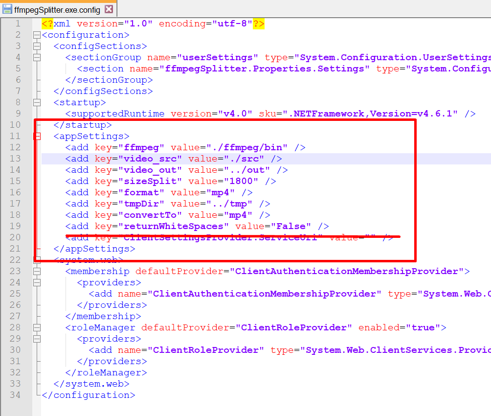
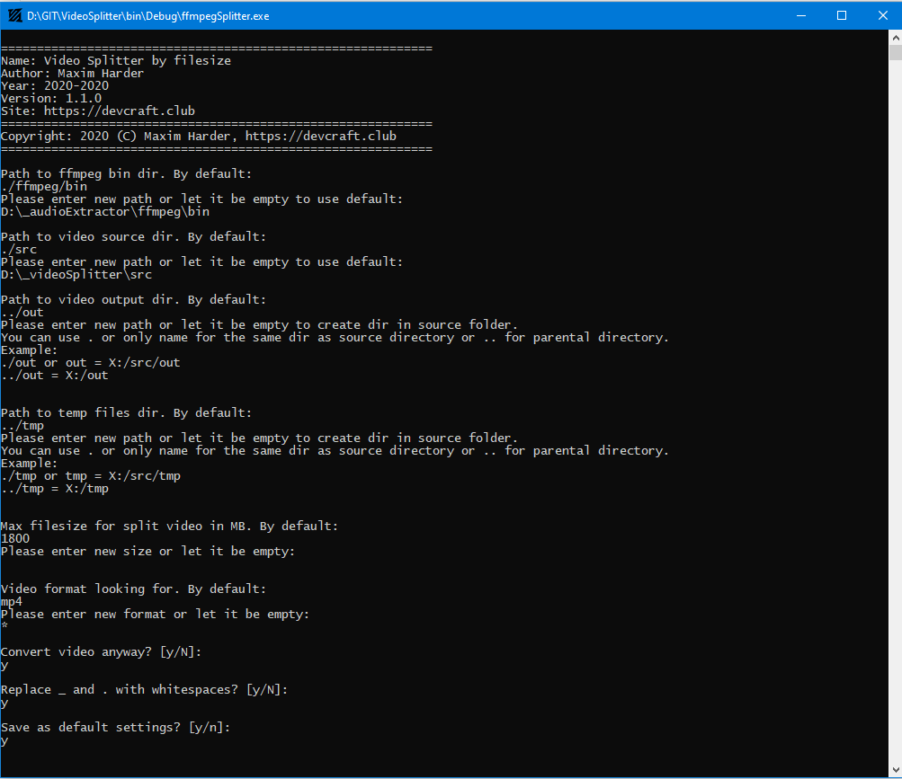
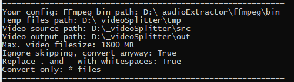
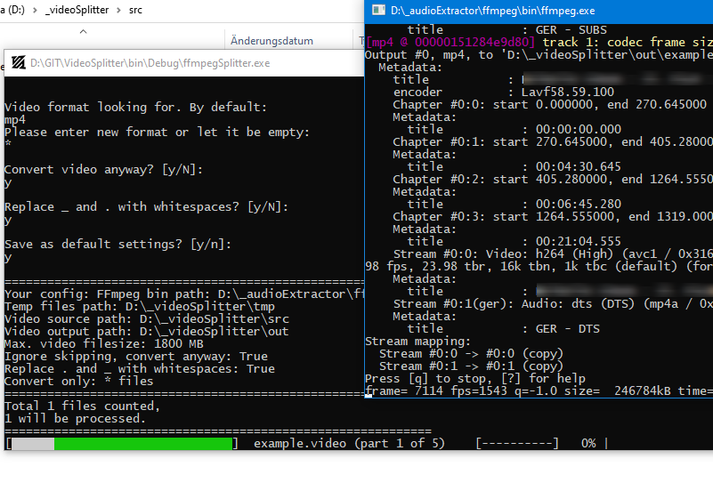
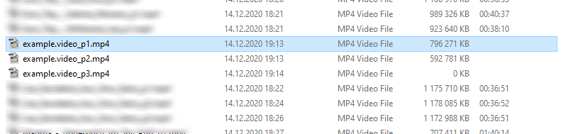

# VideoSplitter

  

Simple video splitter for WhatsApp, Telegram and etc. You just need to set up the max. file size and this app will split video(s) fast and automatically.

It's a console app, so you have to type all params in a console. Don't worry those are just a few and you don't have to retype settings every time on start.

# Requirements

- [FFMpeg](https://www.gyan.dev/ffmpeg/builds/) for Windows
- [Microsoft .NET Framework 4.6.1](https://www.microsoft.com/de-de/download/details.aspx?id=49982)

# Possible settings

- Path to FFMpeg bin dir (folder)
- Path to video source dir (folder)
- Path to video output dir (folder)
- Path to temp files dir (folder)
- Max. filesize in MB
- Search for especially video extension (mp4, avi, flv, wmv, mkv, ... - I guess any video is supported by FFMpeg)
- Replace . and \_ with whitespaces for splitted videos
- Remove source video that was used for splitting

You can apply custom settings even before the first start. Or even if the script won't save them. Open <kbd>ffmpegSplitter.exe.config</kbd> with editor or notepad and find those lines:

Find **appSettings** and for each key you can put your own lines into it.

# How It Works

To split a video, you need to specify the exact file size limit in MB. The script determines how many files the video file should be splitted into based on the specified file size. However, the split is not exactly based on the file size, but on the uniformity of the video duration.

**For example**: a **6.5 GB** video file with a duration of **3 hours**. The file will be splitted into **6** parts with a duration of **30 minutes** and size of **1.08 GB**. The last split of the video file in practice turns out to be larger and longer than the previous splits, since they retain the difference in milliseconds that is possible during splitting.

You need the FFMPEG library for Windows so that the script could processe the video correctly.

If the video has a different file extension than mp4, the library recodes the files itself. In particular, this applies to AVI and WMV files. In other cases, the script "copies" sections in the form of parts.

# Screenshot

   

# Have Fun
